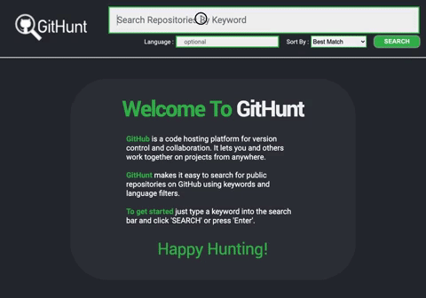
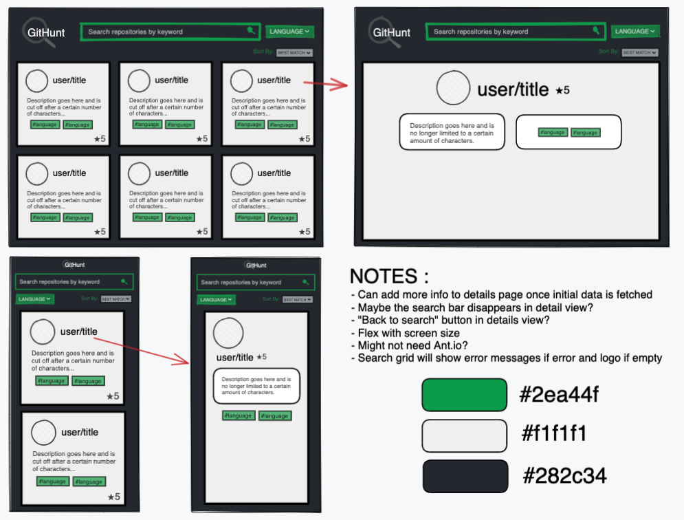

 

  
  <h1 align="center" style="padding:0px; margin:10px 0px">GitHunt</h1>
  <h5 align="center" style="margin:0px 0px 20px 0px; padding:0px;">Executed by Kristi Miller</h5>
  

    This is a code challenge for an open React Software Engineer position. The company wants to create a repository search application that utilizes the GitHub repository search API. The application displays the results of a query, and allows a user to sort and filter the results.
     
  

## About The Project

### Tools Used
* TypeScript
* ReactJS
* Jest
* React Testing Library
* CSS

### Getting Started

Run `git clone git@github.com:Kristiannmiller/HE-Code-Exercise.git`

Navigate to the project directory and run `npm install`, then `npm start`

The application should start in a new browser tab

To run the tests, run `npm test`

### Project Specifications
#### User Stories
- Search Input : The application should include an input to type in the text to search GitHub.
- Search Results : The application should display the results of the search.
- Sort Results : The results should be sorted by best match as a default, and allow a user to sort by stars.
- Filter Results : The user should be able to filter their results by language.
- Detailed Result Page : When a user clicks on a result, it should display a detailed page of that result.

#### Development Details
- Responsive Design : The application should render properly on mobile, tablet, laptop, and large desktop.
- React : The application should be built using React.
- Pages : The application should have at least two pages (Search page & Detail page).
- Language : Please write your code in JavaScript or TypeScript.

## About The Process

### My Process
1. READING / RESEARCH : I have used TypeScript before, but wanted to give myself some time to research and understand it a little more, so I allocated a few hours to tutorials. I also used this time to familiarize myself with the GitHub API and the provided project details.

2. PLANNING / SETUP : I created the repo using create-react-app. I then planned out my schedule, and sequenced out sprints as GitHub milestones with connecting issues as tasks. I kept track of the tasks through Github Projects.

3. LAYOUT : I created a wireframe of my design idea, and came up with the general component architecture for the app.

4. FUNCTIONALITY : I tackled issues one by one, following the project details.

3. TESTING : I implemented tests for all components.

4. DOCUMENTATION : I updated the documentation of GitHunt to show my journey and left comments/questions for newcomers within the codebase.

## Wins

- Architecture / Design : I had a blast doing this project because I loved the design. I was able to create a fully responsive product that's a close match to the wireframe. The architecture was well thought out, and made testing a breeze.

- TypeScript : It's always a challenge using TypeScript in a quick project. This time around I came across a few minor issues that I had seen before and knew how to work around. Overall I feel like this project really helped me gain a greater understanding of TypeScript.

## Challenges

- The API : The docs for the API were a little misleading. I started off using Octokit to fetch from the API because the docs made it seem like a necessity for authentication. I eventually ended up using Axios, and it works great!

- Async Testing : I ran into some issues with testing the result of the APIcall. I'm sure a little extra time spent on testing would get me the result I'm looking for though.

## Contact Kristi
* [Github](https://github.com/Kristiannmiller)
* [Portfolio](http://www.kristiannmiller.com)
* [LinkedIn](https://www.linkedin.com/in/kristiannmiller/)

## Additional Links
- [Repository](https://github.com/Kristiannmiller/HE-Code-Exercise)
- [Project Board](https://github.com/Kristiannmiller/HE-Code-Exercise/projects/1)
- [GitHub Repository Search API](https://docs.github.com/en/rest/reference/search#search-repositories)
- [GitHub User Stat Repo](https://github.com/anuraghazra/github-readme-stats)
- [Icons From Iconmonstr](https://iconmonstr.com/)
